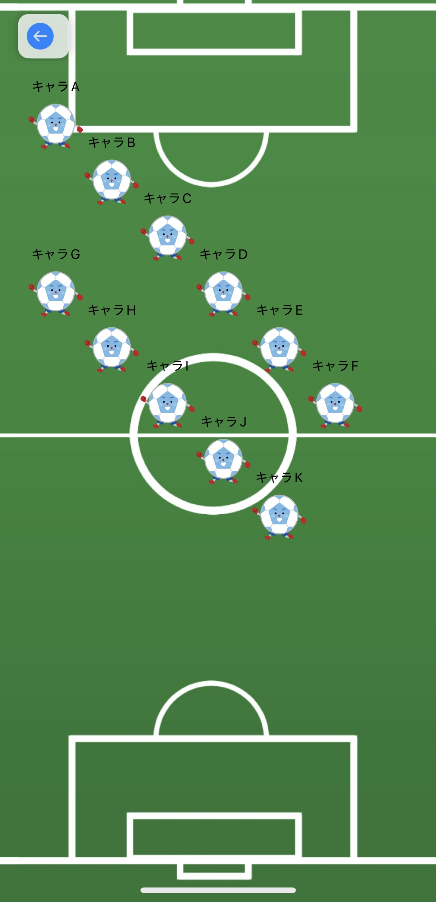
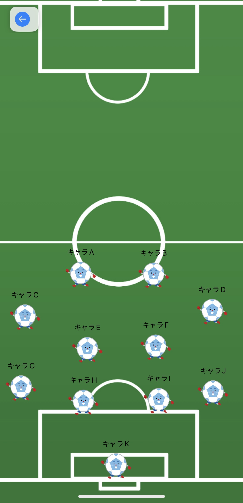
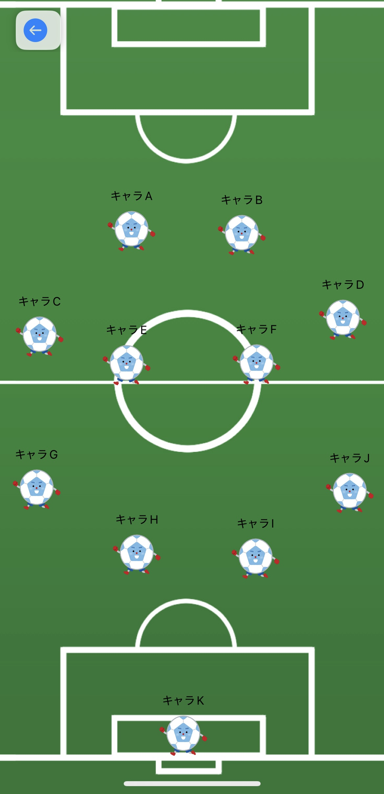

# InazumaFormation

## 注意事項

本アプリは現在プロトタイプ段階にあります。
最低限の機能のみが実装されており、今後の改良・拡張を予定しています。

現在は以下の機能のみ実装されています：
- フォーメーション編集画面
- サッカーコートを模した画面上でテンプレート選手の位置をドラッグ＆ドロップで移動

### 未実装・今後の予定

- 選手データの新規登録・保存機能
- 選手アイコンの変更機能（名前・画像）
- フォーメーション記録の保存機能
- 試合記録の保存機能
- 共有機能

---

## 概要
サッカーのフォーメーション策定や戦術策定をサポートするiOSアプリです。
選手アイコンを視覚的かつ直感的に配置できるドラッグ＆ドロップ操作を取り入れ、楽しく・使いやすくデザインしました。
フォーメーション記録を保存・共有することも可能です。

   


| 項目 | 内容 |
|------|------|
| 開発者 | HiroKawano（個人開発） |
| 対応OS | iOS（SwiftUI対応） |
| 技術構成 | Swift, SwiftUI |
| バージョン | Prototype |
| ライセンス | MIT（自由にご利用いただけます） |

---

## アプリの目的

- 従来のホワイトボードなどを使う戦術会議は利便性に欠ける
- 部内・大会向けに視覚的で操作しやすいUIのニーズがある
- デジタルで保存・共有・履歴管理を実現することで利便性を高める
- 手元の端末で簡単・直感的にフォーメーションを考案できる
- フォーメーション記録を保存・振り返りにも活用できる

---

## 主な機能

- 選手データの新規登録・編集・保存機能
- 選手アイコンの変更機能（名前・画像）
- サッカーコートを模した画面上で選手の位置をドラッグ＆ドロップで移動
- フォーメーション記録の保存機能
- 試合記録の保存機能
- 共有機能

---

##  使用方法

1. アプリを起動  
2. 一覧画面からフォーメーションを選択  
3. 選手をドラッグ&ドロップで任意の位置に配置
4. 保存して履歴に追加、または共有ボタンで画像出力

---

## 📁 ディレクトリ構成

以下はプロジェクト内の主な構成です：
```text
InazumaFormation/
├── InazumaFormationApp.swift
├── Models/
│   ├──Character.swift
│   ├──CharacterData.swift
│   └──Formation.swift
├── Views/
│   └──MainView.swift
├── ViewModels/
│   ├──FormationFieldview.swift
│   └──FormationViewModel.swift
├──Assets.xcassets/
│   ├── AppIcon.appiconset/
│   ├── Character_icon.imageset/
│   ├──soccer_field.imageset/
│   └── AccentColor.colorset/
├── Docs/
│   ├── 要件定義書.md
│   ├── README.md
│   └── 画面遷移図.png
└── README.md

